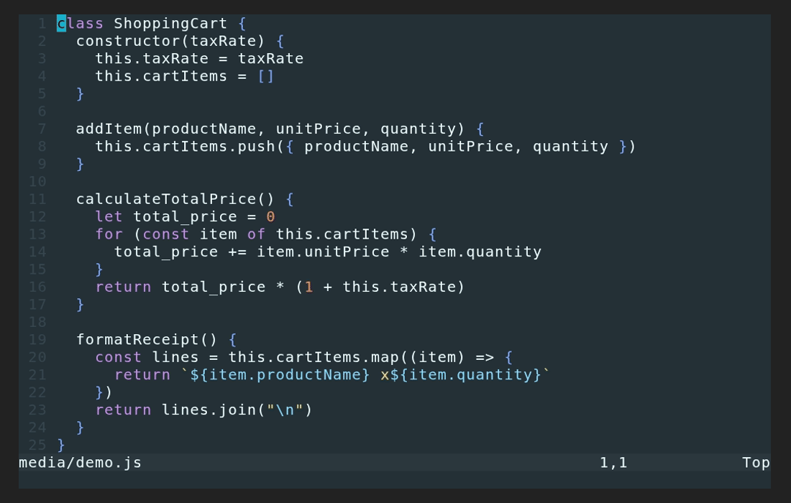

# nvim-labels

Label-based navigation and character insertion in Neovim.



## Install

With [lazy.nvim]:

```lua
{ "surgiie/nvim-labels", opts = {} }
```

[lazy.nvim]: https://github.com/folke/lazy.nvim

`opts = {}` runs `setup()` for you (merges options, defines highlight groups) — calling it yourself is otherwise optional.

On load, the plugin adds:

| Command | Default mapping | Action |
| --- | --- | --- |
| `:NvimLabelJump` | `<leader>j` (normal) | Jump to a word |
| `:NvimLabelCharShortcut` | `<C-\>` (normal, insert) | Insert a [character shortcut](#character-shortcuts) |

Change or drop a mapping before the plugin loads (with lazy.nvim, in an `init` function on the spec):

```lua
vim.g.labels_jump_key = "s"
vim.g.labels_char_key = "<C-l>"
vim.g.labels_no_default_mappings = true  -- map labels.jump / labels.insert_char_shortcut yourself
```

> `labels_char_key` skips `<leader>` by default: if your leader is `<Space>` (common), an insert-mode `<leader>...` mapping makes every space you type wait out `timeoutlen`.

## Usage

### Jump navigation

Press `<leader>j` (or `:NvimLabelJump`):

- Every word in the visible window gets a label — `camelCase` / `snake_case` parts too, by default — and the rest of the view dims.
- Type the label to jump. Multi-key labels narrow as you type, showing only the keys left to press.
- `<BS>` undoes a key; `<Esc>` / `<C-c>` cancels.
- The starting position goes on the jumplist (`<C-o>` returns).

### Character shortcuts

Handy on reduced/split keyboard layouts. Press `<C-\>` (or `:NvimLabelCharShortcut`):

- A floating window lists your configured `char_shortcuts`, each behind a label.
- Pick one and it's inserted at the cursor; you land in insert mode, whichever mode you invoked from.

```lua
require("nvim-labels").setup({
  -- e.g. the US QWERTY shifted row, in whatever order suits your layout
  char_shortcuts = { "!", "@", "#", "$", "%", "^", "&", "*", "(", ")", "-", "_", "=", "+" },
})
```

A few extras:

- Entries aren't limited to single ASCII characters — multi-char snippets (`"()"`, `` "```" ``) and unicode symbols (`λ`, `→`, `§`) work too.
- Include a `<cursor>` marker to say where the cursor lands, instead of after the whole insertion:
  ```lua
  char_shortcuts = { "(<cursor>)", "[<cursor>]", '"<cursor>"' }
  ```
- Entries can span multiple lines with `\n`; each line becomes its own buffer line, and the marker can be on any of them:
  ```lua
  char_shortcuts = { "if true then\n<cursor>\nend" }
  ```
- An entry can be a table instead of a plain string — `{ char = "...", name = "..." }`. `char` is still what gets inserted; `name` is what the grid shows in its place, so a long or multi-line entry doesn't wreck the grid's width:
  ```lua
  char_shortcuts = {
    { char = "if true then\n<cursor>\nend", name = "if" },
    { char = "^", name = "caret" },
  }
  ```

## Configuration

```lua
require("nvim-labels").setup({
  keys = "fjdkslaghrueiwotnvbc", -- label alphabet, most-reachable keys first
  pattern = "[%w_]+",            -- Lua pattern; each match is a word chunk
  subwords = true,               -- also target camelCase / snake_case / kebab-case parts
  dim = true,
  jumplist = true,
  exclude_cursor_word = true,
  char_shortcuts = {},           -- characters for the character shortcuts picker
})
```

| Option | Default | Notes |
| --- | --- | --- |
| `keys` | `"fjdkslaghrueiwotnvbc"` | Label alphabet, most-reachable keys first |
| `pattern` | `"[%w_]+"` | [Lua pattern] selecting word chunks; `subwords` splits each further |
| `subwords` | `true` | Split at `_`, `-`, and camelCase/PascalCase boundaries (`fooBar`, `HTMLElement`), the way nvim-spider moves. `false` = plain word starts. |
| `dim` | `true` | Dim the rest of the view while jumping |
| `jumplist` | `true` | Push the pre-jump position onto the jumplist |
| `exclude_cursor_word` | `true` | Don't label the word under the cursor |
| `char_shortcuts` | `{}` | Entries for the [character shortcuts](#character-shortcuts) picker |

[Lua pattern]: https://www.lua.org/manual/5.1/manual.html#5.4.1

Other `pattern` values:

| Chunks | Pattern |
| --- | --- |
| Words (default) | `"[%w_]+"` |
| Every non-blank run | `"%S+"` |

### Highlights

| Group | Default | Used for |
| --- | --- | --- |
| `LabelPick` | white bold on `#1e1e2e` | The label text |
| `LabelDim` | `#585b70` text | The dimmed rest of the view / the picker's non-matching entries |

Both use `default = true`, so a colorscheme or your config can override them:

```lua
vim.api.nvim_set_hl(0, "LabelPick", { fg = "#ffffff", bg = "NONE", bold = true })
```

## Labels

`lua/nvim-labels/label.lua` builds a prefix-free set:

- Start with one slot per key.
- While there are fewer slots than targets, split the right-most shortest slot into one child per key.
- Shortest labels go first — to the nearest targets (jump), or the first entries in `char_shortcuts` (character shortcuts).

## Tests

```sh
nvim -l tests/label_spec.lua
nvim --headless -u NONE -l tests/jump_headless.lua
nvim --headless -u NONE -l tests/shortcuts_headless.lua
```

Manual: `nvim --clean -u tests/minimal_init.lua <file>`, then `\j` (jump) or `<C-\>` (character shortcuts — set `char_shortcuts` in `tests/minimal_init.lua` first).

The demo GIF above is generated from `media/demo.tape` with [VHS]:

```sh
vhs media/demo.tape
```

[VHS]: https://github.com/charmbracelet/vhs

## Not implemented

- Operator-pending and visual motions (`d<label>`).
- Labeling across every visible window.
- Search-then-label (type a char or two first, label only matches).
